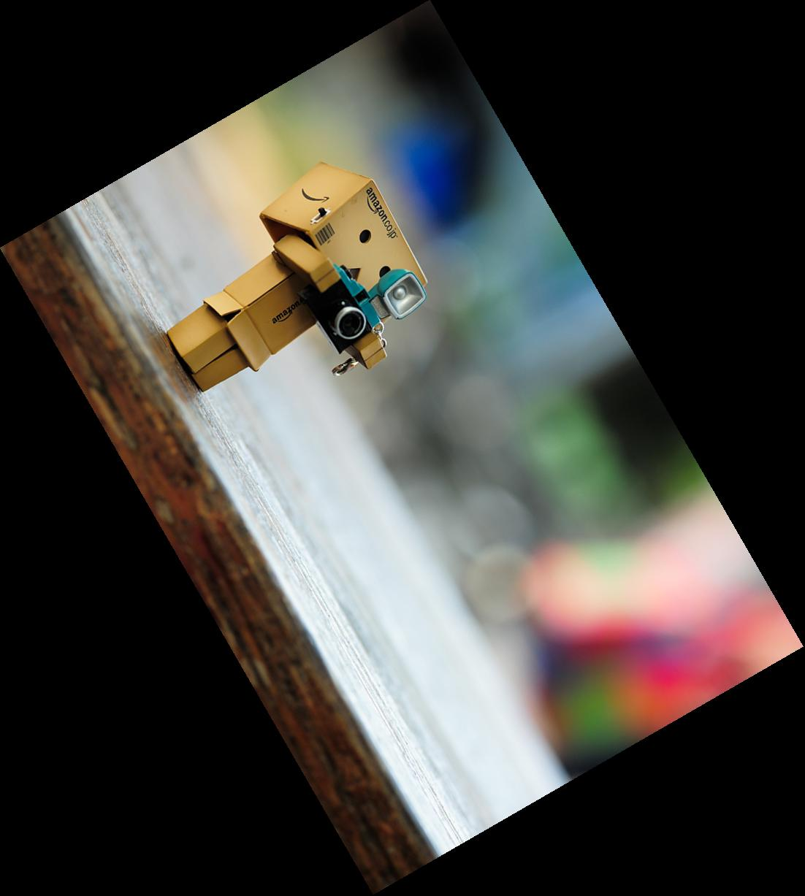
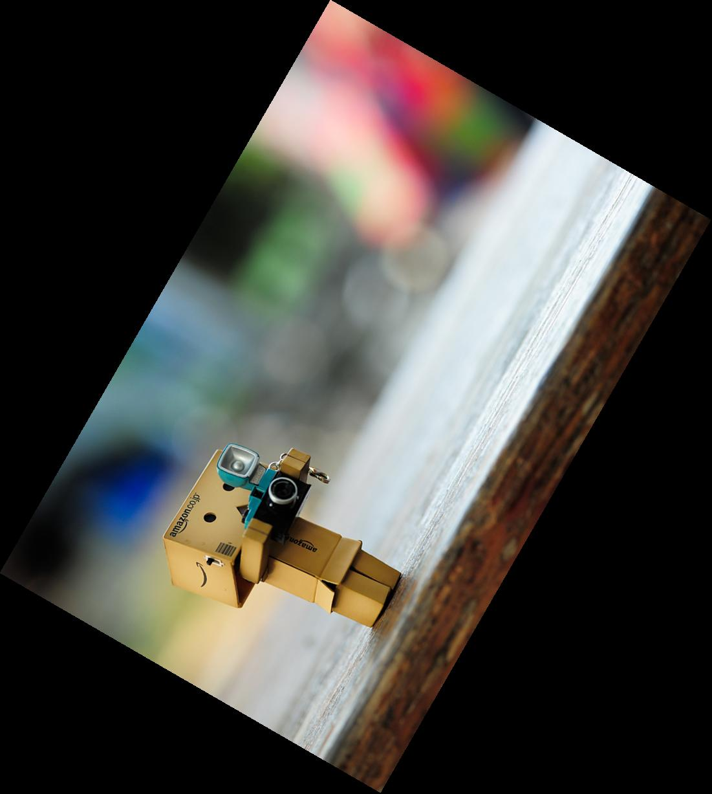

# Huang Cong Yao <span style="color:red">(103000002)</span>

# Project 1 / Image Filtering and Hybrid Images

## Overview
The project is related to basic matrix processing on Matlab.
> Our goal is to complete several functions : image flipping, image rotation.


## Implementation
1. flipping the image
	* In this part we should complete three features : vertical flipping, horizontal flipping and flipping in both directions. For the vertical flipping, the output's height index should be reversed, so the pseudo code should look like this :
		```
		out(1->height,w) = in(height->1,w)
		```
	* And the horizontal flipping is similar to vertical, just change the reverse index from height to width :
		```
		out(h,1->width) = in(h,width->1)
		```
	* Combining the features of the upper two flipping modes, we get the both mode:
		```
		out(1->height,1->width) = in(height->1,width->1)
		```
	* Before we ruturn the output image, we should transfer the data to utf8, just simply divide everything by 255.
2. rotating the image
	* In this part, we should output the image with given rotating degree. By multiplicating the rotation matrix with our vertices, we can get the rotated vertices first, and the rotated vertices would contain negative indexes, so we should shift the image to make them non-negative.
	* By shifting the **magnitude of the vertices** which have the **smallest index in both axes**, the whole image will be aligned with x-axis and y-axis again. The shifting amount should be stored because we'll use it later.
	* Now we need to calculate the new height and width, which is equal to the difference of the maximum and minimum of vertices in both axes, and we should create an empty array with the shape of the calculated height and weight.
	* For every index of the new array, we should shift back (the stored shifting amount) and rotate back (by multiplying with the transpose of the rotation matrix) to find it's original index, and then we can collect our data from the input image.
	* However, the calculated original index may be non-integer, so we should get the data by interpolating the surrounding indexes.
	* There are one exception from the given interpolation equation, that is when `x1` is equal to `x2`, which will lead to the result of zero in denominator. In order to handling this, we consider the equal situation, and find that the proper wa(or wb) must be either `x1` or `x2`, or we can say `(x1 + x2)*0.5`, so we can add a statement when calculating `wa` and `wb` :
		```
        if (x1 == x2)
            wa = 0.5;
        else
            wa = (old(1) - x1)/(x2 - x1);
        end
		```
	* After collecting the interpolated data from our traced back indexes, we can obtain our rotated image!
		## Installation
		* Other required packages. NO
		* How to compile from source? RUN

		### Results

<table border=1>
<tr>
<td><p>Original Picture</p></td>
<td><p>image</p></td>
<td><p>my image</p></td>
</tr>

<tr>
<td><p>Greyscale Picture</p></td>
<td><p>image</p></td>
<td><p>my image</p></td>
</tr>

<tr>
<td><p>Vertical Flipped Picture</p></td>
<td><p>image</p></td>
<td><p>my image</p></td>
</tr>

<tr>
<td><p>Both Flipped Picture</p></td>
<td><p>image</p></td>
<td><p>my image</p></td>
</tr>

<tr>
<td><p>Rotation Clockwise Picture</p></td>
<td><p>image</p></td>
<td><p>my image</p></td>
</tr>

<tr>
<td><p>Rotation Counter-clockwise Picture</p></td>
<td><p>image</p></td>
<td><p>my image</p></td>
</tr>
</table>


